# DevOps Project Context - Datascientest

## Deploying a Reddit Application on Amazon Elastic Kubernetes Service (EKS) with ArgoCD, Monitoring its Performance with Prometheus and Grafana, Backup and Restore with Velero

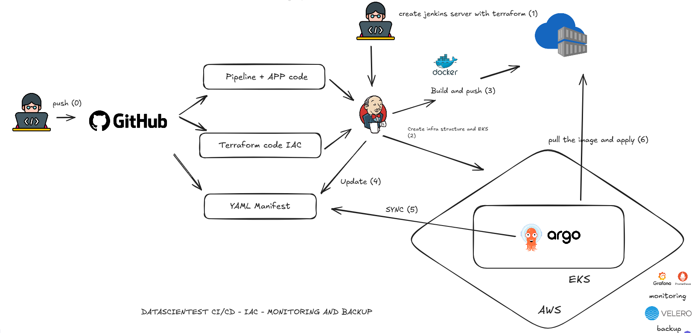


## Introduction

In the ever-evolving world of modern software development, the convergence of development, security, and operations, known as **DevOps**, has become essential for delivering reliable and secure applications at scale. As organizations strive to accelerate their delivery cycles while maintaining high standards of security and reliability, adopting robust **DevOps Datascientest** practices is crucial.

In this project, we will delve into the exciting world of DevOps by exploring how to deploy a popular application, **Reddit**, on **Amazon Elastic Kubernetes Service (EKS)** using **ArgoCD**, a GitOps continuous delivery tool. We will also monitor its performance for optimal results and implement a backup plan for disaster recovery.

We will go through each step of this process: from setting up the infrastructure on AWS EKS to orchestrating the deployment with ArgoCD, as well as implementing comprehensive monitoring solutions to ensure the health and performance of our Reddit application.

Join us on this journey to demystify the nuances of DevOps, combining the agility of modern development practices with the robustness of security and operational excellence. By the end of this journey, you will have gained valuable knowledge to build resilient and secure cloud-native applications and will be ready to apply DevOps principles to your own projects with confidence and success. Let's dive in!

------

## Why ArgoCD and AWS EKS?

**Amazon EKS (Elastic Kubernetes Service)** and **Argo CD** form a powerful combination for deploying and managing containerized applications reliably and efficiently in the AWS cloud. Here are the main reasons why you might choose this solution:

### Amazon EKS:

- **Managed Kubernetes:** EKS allows you to enjoy the benefits of Kubernetes without managing the underlying infrastructure. AWS handles updates, security, and high availability for your cluster.
- **Deep Integration with AWS:** EKS integrates natively with other AWS services like IAM, VPC, EBS, etc., making it easier to manage your cloud resources.
- **Community and Ecosystem:** Kubernetes is a highly popular open-source platform, so you benefit from a vast community, numerous tools, and abundant documentation.

### Argo CD:

- **GitOps:** Argo CD is a GitOps deployment tool that allows you to manage the desired state of your application in a Git repository. This ensures full traceability and facilitates collaboration between development and infrastructure teams.
- **Automation:** Argo CD automates the deployment and update process for your applications, reducing manual errors and speeding up production rollouts.
- **Continuous Synchronization:** Argo CD continuously monitors your Git repository and automatically synchronizes your Kubernetes cluster with changes made.
- **Visualization and Auditing:** Argo CD provides an intuitive user interface to visualize your application's state, track deployment history, and perform audits.

### Why combine EKS and Argo CD?

By combining EKS and Argo CD, you get:

- **Automated and Reliable Deployments:** Argo CD takes care of deploying and updating your applications on your EKS cluster in an automated and reliable manner, following GitOps best practices.
- **Declarative Management:** You describe the desired state of your application in a YAML file, and Argo CD ensures that this state is maintained in your cluster.
- **Improved Collaboration:** GitOps enhances collaboration between development and infrastructure teams by providing a single source of truth for the application's state.
- **Better Governance:** Argo CD allows you to set up access controls and approval workflows to ensure the security and compliance of your deployments.

**In summary**, EKS and Argo CD offer a complete solution for deploying and managing containerized applications in the AWS cloud effectively, securely, and in accordance with best practices.

**Typical use cases:**

- **Continuous Deployments:** Integrate Argo CD into your CI/CD pipeline to automatically deploy new versions of your application.
- **Managing Multiple Environments:** Use different Git branches to manage different environments (development, staging, production).
- **Easy Rollbacks:** In case of an issue, you can easily revert to a previous version of your application by simply changing your Git repository.

### 1. **GitOps Workflow**

ArgoCD follows the GitOps methodology, where the desired state of the Kubernetes cluster is declaratively defined in Git repositories. This approach brings many benefits, including versioned configurations, enhanced traceability, and the ability to easily revert to previous versions. By using Git as the single source of truth, ArgoCD ensures consistency and reliability in deployments.

GitOps is a methodology for managing Kubernetes infrastructure and applications using Git as the source of truth. Here’s a general overview of the GitOps workflow:

**1. Define the desired state:**

- **Declare infrastructure and applications:** Use YAML files to describe the desired state of your Kubernetes infrastructure (deployments, services, configurations, etc.).
- **Store in Git:** Commit these YAML files into a Git repository (e.g., GitHub, GitLab, Bitbucket).

**2. Automated Deployment:**

- **GitOps Deployment Tool:** Use a tool like Argo CD, Flux, or Jenkins X to monitor the Git repository.
- **Automatic Synchronization:** The tool compares the current state of the cluster with the state defined in Git.
- **Apply Changes:** If discrepancies are detected, the tool automatically applies the necessary changes to the cluster to match the desired state.

**3. Managing Changes:**

- **Pull Requests:** Use Pull Requests in Git to propose changes to infrastructure or applications.
- **Code Review:** Perform code reviews to validate changes before deployment.
- **Approvals:** Implement approval workflows to ensure changes are properly evaluated before being applied.

**4. Monitoring and Auditing:**

- **Change History:** Git provides a complete history of changes made to infrastructure and applications.
- **Event Logs:** The GitOps deployment tool logs deployment events, errors, and successes.
- **Visualization:** Use dashboards and visualization tools to monitor your deployments and quickly identify issues.

**5. Rollbacks:**

- **Easily Reversible:** In case of problems, you can easily revert to a previous version of your infrastructure by reverting to a previous commit in Git.
- **Automated Rollbacks:** Some GitOps tools can automate rollbacks based on certain conditions.

**Benefits of GitOps:**

- **Automation:** Reduces human errors and speeds up deployments.
- **Traceability:** Provides a complete history of changes and facilitates debugging.
- **Collaboration:** Enhances collaboration between development and infrastructure teams.
- **Reliability:** Improves deployment reliability and stability.
- **Security:** Enhances security through access management and approval controls.

### 2. **Declarative Configuration Management**

EKS provides a managed Kubernetes service, simplifying cluster management and provisioning. With EKS, you can focus on deploying and running containerized applications without worrying about the underlying infrastructure. ArgoCD complements EKS by providing declarative management of Kubernetes resources, simplifying the deployment process and promoting infrastructure-as-code practices.

### 3. **Continuous Deployment**

ArgoCD automates the deployment process, continuously monitors Git repositories for changes, and synchronizes the cluster state with the desired state defined in the Git repository. This enables fast and reliable deployments while giving teams the confidence to deploy new features.

### 4. **Integration with Kubernetes**

EKS integrates seamlessly with ArgoCD, providing a scalable and reliable platform for running Kubernetes workloads. ArgoCD uses Kubernetes native resources like Custom Resource Definitions (CRDs) and controllers to manage applications and synchronize their state with the cluster.

### 5. **Robust Monitoring and Observability**

Both ArgoCD and EKS offer advanced monitoring and observability features. EKS integrates with popular tools like Prometheus and Grafana or Datadog, providing insights into cluster health, performance metrics, and application behavior. ArgoCD provides visibility into the deployment process, including synchronization status, application health, and audit logs, enabling teams to troubleshoot effectively.

The choice between Grafana and Prometheus versus Datadog for setting up a robust monitoring and observability solution largely depends on your specific needs, infrastructure, and tool preferences.

### Grafana and Prometheus: A Powerful and Flexible Combination

- **Grafana**: It is an open-source data visualization platform that allows you to create rich, interactive dashboards from various data sources. It excels in visualizing metrics, logs, and traces.
- **Prometheus**: It is an open-source monitoring system designed to collect and store real-time metrics. It is especially well-suited for dynamic environments and containerized applications.

**Advantages of this combination:**

- **Flexibility:** Highly customizable dashboards and alerts.
- **Cost:** Open-source, hence free.
- **Community:** Strong community and ecosystem of extensions.
- **Integration:** Easily integrates with other Kubernetes ecosystem tools.

**Disadvantages:**

- **Complexity:** Requires more manual setup compared to Datadog.
- **Maintenance:** Needs infrastructure management.

### Datadog: An All-in-One Solution

Datadog is a cloud-native observability platform that provides a complete solution for monitoring applications, infrastructure, and services. It combines monitoring, logging, and tracing capabilities in one interface.

**Advantages of Datadog:**

- **Simplicity:** User-friendly interface and simplified setup.
- **Rich Features:** Includes advanced features such as anomaly detection, dependency mapping, and integration with many tools.
- **Scalability:** Easily scalable for large environments.

**Disadvantages:**

- **Cost:** Pricing model based on usage, which can become expensive for large organizations.
- **Vendor Lock-in:** Potential vendor lock-in if you choose to migrate to a different solution.

### When to Choose Which?

- Choose Grafana and Prometheus if:
  - You need a highly customizable and flexible solution.
  - You want complete control over your infrastructure.
  - You have budget constraints.
- Choose Datadog if:
  - You need an all-in-one solution that is easy to set up.
  - You require advanced features like anomaly detection and dependency mapping.
  - You are willing to invest in a commercial solution.

### Selection Criteria

- **Infrastructure Complexity:** A complex infrastructure might benefit from a solution like Datadog to simplify management.
- **Budget:** If cost is a determining factor, Grafana and Prometheus may be more suitable.
- **Customization Needs:** If you have specific needs for visualization and alerts, Grafana offers great flexibility.
- **Team:** The technical skills of your team might influence your choice.

### 6. **Backup and Restore with Velero**

**Velero** is a powerful and flexible open-source tool designed for reliably backing up and restoring Kubernetes cluster resources, including persistent volumes. It is especially useful for:

- **Regular Backups:** Setting up automatic backups to ensure business continuity.
- **Disaster Recovery:** Quickly restoring your cluster in case of failure or data loss.
- **Migration:** Moving applications from one cluster to another.

### How Does It Work?

Velero works by creating snapshots of your Kubernetes resources and storing them in a storage backend of your choice (S3, Google Cloud Storage, etc.). During a restore, Velero uses these snapshots to recreate resources in a new or existing cluster.

### Why Use Velero?

- **Versatility:** Supports a wide range of storage backends and cloud providers.
- **Flexibility:** Allows you to customize backups and restores with policies and hooks.
- **Easy Integration:** Integrates easily with other tools in the Kubernetes ecosystem.
- **Active Community:** Benefits from a large community and rich documentation.

### Key Features

- **Kubernetes Resource Backups:** Backups of pods, services, deployments, persistent volumes, etc.
- **Persistent Volume Backups:** Supports various types of persistent volumes (NFS, iSCSI, etc.).
- **Selective Restoration:** Ability to restore specific resources or the entire cluster.
- **Backup Policies:** Defines custom backup policies (frequency, retention, etc.).
- **CI/CD Integration:** Automates backups and restores in your CI/CD pipeline.

------

## **Prerequisites**

Before you begin, ensure that you have the following:

- A functional Kubernetes cluster (EKS, kubeadm, etc.).

- An AWS account with the necessary permissions to create an S3 bucket and an IAM policy.

- The `kubectl` command-line tool configured.

- The `aws-cli` tool configured for your AWS account.

- An AWS user or role with access to the S3 bucket.

  

1. - ### **Step 1: Set Up the Jenkins Server**
   
     1. **Clone the repository:**
   
        ```shell
        git clone https://github.com/DataScientest/Project-datascientest-eks-argo-GitOps_EN.git
        cd Reddit-Project/Jenkins-Server-TF/
        ```
   
     2. **Modify the `backend.tf` file:**
   
        - Create an S3 bucket and a DynamoDB table.
   
        ```shell
        # Specify the AWS provider
        provider "aws" {
          region = "us-east-1" # Replace with your preferred region
        }
        
        # Create an S3 bucket
        resource "aws_s3_bucket" "example_bucket" {
          bucket        = "example-terraform-bucket-123456" # Replace with a unique name
          acl           = "private"
        
          tags = {
            Name        = "example-s3-bucket"
            Environment = "Dev"
          }
        }
        
        # Create a DynamoDB table
        resource "aws_dynamodb_table" "example_table" {
          name         = "example-terraform-table"
          billing_mode = "PAY_PER_REQUEST"
        
          attribute {
            name = "id"
            type = "S" # 'S' for String, 'N' for Number, etc.
          }
        
          hash_key = "id"
        
          tags = {
            Name        = "example-dynamodb-table"
            Environment = "Dev"
          }
        }
        ```
   
     3. **Install Terraform and AWS CLI:**
   
        ```shell
        # Install Terraform
        sudo apt install wget -y
        wget -O- https://apt.releases.hashicorp.com/gpg | sudo gpg --dearmor -o /usr/share/keyrings/hashicorp-archive-keyring.gpg
        echo "deb [signed-by=/usr/share/keyrings/hashicorp-archive-keyring.gpg] https://apt.releases.hashicorp.com $(lsb_release -cs) main" | sudo tee /etc/apt/sources.list.d/hashicorp.list
        sudo apt update && sudo apt install terraform
        
        # Install AWS CLI
        curl "https://awscli.amazonaws.com/awscli-exe-linux-x86_64.zip" -o "awscliv2.zip"
        sudo apt-get install unzip -y
        unzip awscliv2.zip
        sudo ./aws/install
        
        # Configure AWS CLI
        aws configure
        ```
   
        Provide your AWS Access Key ID, Secret Access Key, region, and output format.
   
     4. **Run Terraform commands:**
   
        ```shell
        terraform init
        terraform validate
        terraform plan -var-file=variables.tfvars
        terraform apply -var-file=variables.tfvars --auto-approve
        ```
   
        - This will create an instance on AWS.
   
     5. **Access Jenkins:**
   
        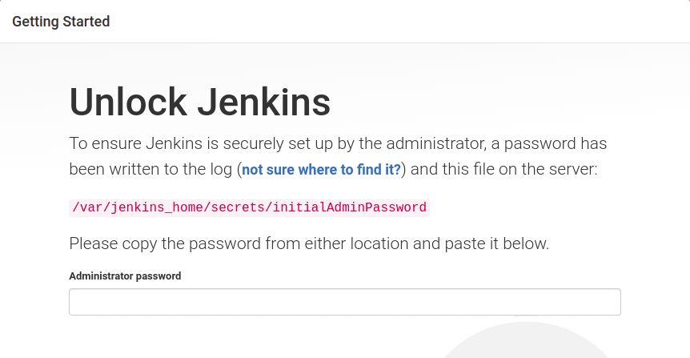
    
        
   
        - Copy the public IP address of the instance and access Jenkins via your preferred browser:
   
          ```
          <public_ip_address>:8080
          ```
   
     6. **Retrieve the Jenkins password:**
   
        ```shell
        cat /var/jenkins_home/secrets/initialadminpassword
        ```
   
        - Log into the instance, retrieve the password, and install the recommended plugins.
   
     7. **Create a Jenkins user:**
   
        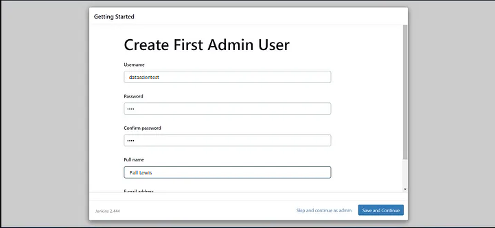
   
        - (Optional) Create a user if you do not wish to keep the default password.
   
     8. **Install necessary plugins:**
   
        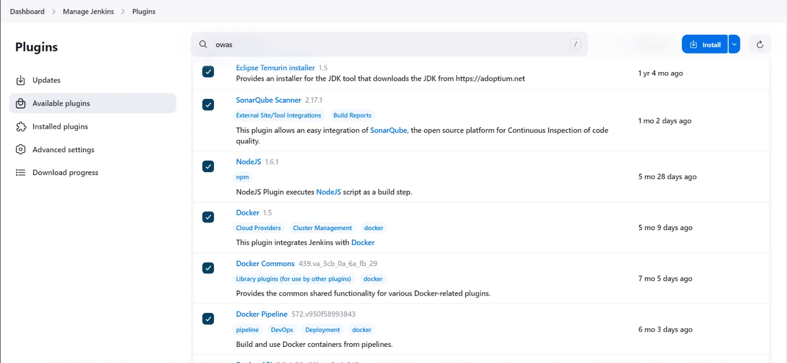
   
        - Go to
   
          Manage Jenkins → Plugins → Available Plugins
   
          and install the following plugins without restarting:
   
          1. Eclipse Temurin Installer
          2. SonarQube Scanner
          3. NodeJs Plugin
          4. Docker Plugins (Docker, Docker commons, Docker pipeline, Docker API, Docker Build step)
          5. OWASP Dependency Check
          6. Terraform
          7. AWS Credentials
          8. Pipeline: AWS Steps
          9. Prometheus Metrics Plugin
   
     9. **Access the SonarQube console created through the installation script on the EC2 instance:**
   
        
   
        ```
        <public_ip_address>:9000
        ```
   
        - The default username and password are "admin". Change the password and configure as needed.
   
          1. Log into the SonarQube web interface.
   
          2. Click on your **user avatar** in the top-right corner, then click **My Account**.
   
          3. Go to the **Tokens** tab.
   
          4. Click on 
   
             `Generate Token`:
   
             - Give the token a name, e.g., `jenkins-token`.
             - Click **Generate**.
   
          5. Copy the generated token. **This token will only be shown once, so save it in a secure place.**
   
          6. Log into Jenkins.
   
          7. Go to **Manage Jenkins** > **Configure System**.
   
          8. Scroll down to the **SonarQube Servers** section.
   
          9. Click on 
   
             Add SonarQube
   
              and configure the following fields:
   
             - **Name**: Provide a descriptive name (e.g., `SonarQube`).
   
             - **Server URL**: Enter the SonarQube server URL (e.g., `http://localhost:9000` or `http://sonarqube.datascientest.com`).
   
             - Authentication Token
   
               :
   
               - Click on **Add** > **Jenkins**.
               - Enter a descriptive ID (e.g., `sonarqube-token`) and paste the copied token from SonarQube.
   
          10. Click **Save** to save the configuration.
   
          ------
   
          1. Go to **Manage Jenkins** > **Global Tool Configuration**.
   
          2. Scroll down to the **SonarQube Scanner** section.
   
          3. Click on 
   
             Add SonarQube Scanner
   
             :
   
             - Provide a name (e.g., `SonarQubeScanner`).
             - Check **Install automatically** to automatically install the scanner.
   
          4. Click **Save**.
   
     10. **Create and configure credentials:**
   
         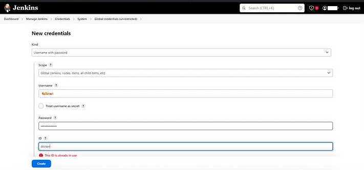
   
         - Go to **Manage Jenkins → Credentials → Global** and create credentials for AWS, GitHub, and Docker.
   
     ------
   
     ### **Step 2: Create an EKS Cluster with the Jenkins Pipeline**
   
     1. **Create a new Jenkins pipeline:**
   
        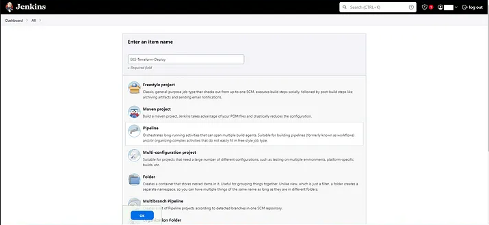
   
        - Click on **New Item**, give it a name, select **Pipeline**, and click **OK**. You will use the content from the `Jenkins-Pipeline-Code/Jenkinsfile-EKS-Terraform` file to create the EKS cluster via the Jenkins pipeline.
   
     2. **Configure the pipeline:**
   
        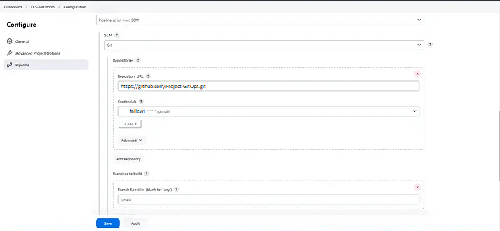
   
        - In the Pipeline section, provide your GitHub project URL, specify the credentials, and the path to the Jenkinsfile.
   
     3. **Run the pipeline:**
   
        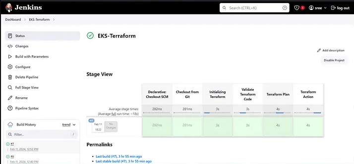
   
        - Click **Apply**, then **Build Now**. This will create an EKS cluster.
   
     ------
   
     ### **Step 3: Create a Jenkins Job to Build and Push the Image**
   
     1. **Create a new Jenkins job:**
   
        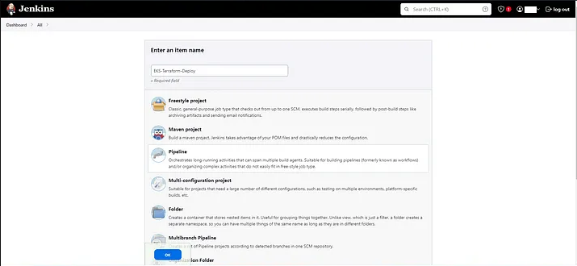
   
        - Click on **New Item**, give it a name, select **Pipeline**, and click **OK**.
   
        - If you are using GitHub Actions instead of Jenkins, you can use the following workflow for the pipeline:
   
          ```shell
          name: fall-project create AWS and EKS infra with Terraform
          
          on:
            push:
              branches: [ "main" ]
              tags: [ 'v*.*.*' ]
            pull_request:
              branches: [ "aws" ]
          
          env:
            AWS_REGION: ${{ vars.AWS_REGION }}
            IAM_ROLE: ${{ secrets.IAM_ROLE}}
            TF_CLOUD_ORGANIZATION: "Cashnow"
            TF_API_TOKEN: "${{ secrets.TF_API_TOKEN }}"
            TF_WORKSPACE: ${{ vars.TF_WORKSPACE }}
          
          permissions:
            id-token: write   # This is required for requesting the JWT
            contents: read    # This is required for actions/checkout
          
          jobs:
            terraform:
              runs-on: ubuntu-latest
              steps:
                - name: Checkout
                  uses: actions/checkout@v3
          
                - name: Configure AWS credentials
                  uses: aws-actions/configure-aws-credentials@v4
                  with:
                    role-to-assume: ${{ env.IAM_ROLE }}
                    role-session-name: GitHub_to_AWS_via_FederatedOIDC
                    aws-region: ${{ env.AWS_REGION }}
                    audience: sts.amazonaws.com.
          
                - name: Upload Configuration
                  uses: hashicorp/tfc-workflows-github/actions/upload-configuration@v1.0.0
                  id: plan-upload
                  with:
                    workspace: ${{ env.TF_WORKSPACE }}
                    directory: ./ 
                    speculative: true
          
                - name: Create Plan Run
                  uses: hashicorp/tfc-workflows-github/actions/create-run@v1.0.0
                  id: plan-run
                  with:
                    workspace: ${{ env.TF_WORKSPACE }}
                    configuration_version: ${{ steps.plan-upload.outputs.configuration_version_id }}
                    plan_only: true
          
                - name: Get Plan Output
                  uses: hashicorp/tfc-workflows-github/actions/plan-output@v1.0.0
                  id: plan-output
                  with:
                    plan: ${{ fromJSON(steps.plan-run.outputs.payload).data.relationships.plan.data.id }}
          
                - name: Upload Configuration
                  uses: hashicorp/tfc-workflows-github/actions/upload-configuration@v1.0.0
                  id: apply-upload
                  with:
                    workspace: ${{ env.TF_WORKSPACE }}
                    directory: ${{ env.CONFIG_DIRECTORY }}
          
                - name: Create Apply Run
                  uses: hashicorp/tfc-workflows-github/actions/create-run@v1.0.0
                  id: apply-run
                  with:
                    workspace: ${{ env.TF_WORKSPACE }}
                    configuration_version: ${{ steps.apply-upload.outputs.configuration_version_id }}
          
                - name: Apply
                  uses: hashicorp/tfc-workflows-github/actions/apply-run@v1.0.0
                  if: fromJSON(steps.apply-run.outputs.payload).data.attributes.actions.IsConfirmable
                  id: apply
                  with:
                    run: ${{ steps.apply-run.outputs.run_id }}
                    comment: "Apply Run from GitHub Actions CI ${{ github.sha }}"
          ```
   
     2. **Create a new pipeline to configure the CI/CD job for the application. The content of the `Jenkins-Pipeline-Code/Jenkinsfile-Reddit` file will be used:**
   
        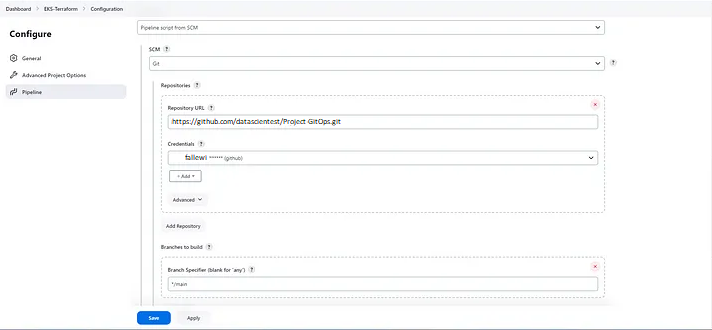
   
        - In the Pipeline section:
          - Choose **Script from SCM**.
          - Configure **Git** with your GitHub credentials.
          - Set the branch to `main` and the pipeline path to `Jenkins-Pipeline-Code/Jenkinsfile-Reddit`.
   
     ### **Step 4: Build the Pipeline**
   
     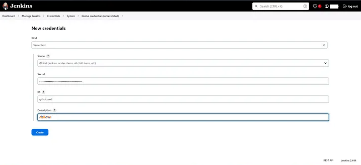
   
     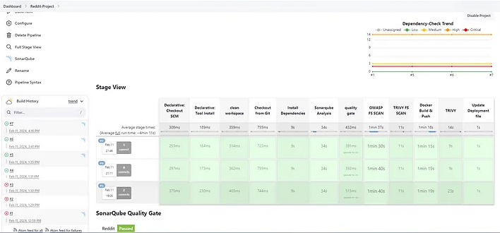
   
     1. **Create a GitHub token:**
        - Before triggering the build, create a GitHub token as a secret text with the ID `githubcred`. This token will be used to update the image created in the `deployment.yml` file.
     2. **Check the analysis results:**
   
     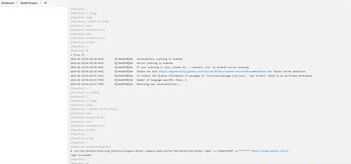
   
     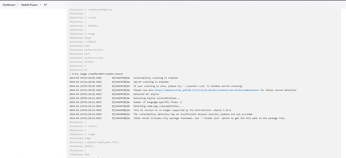
   
     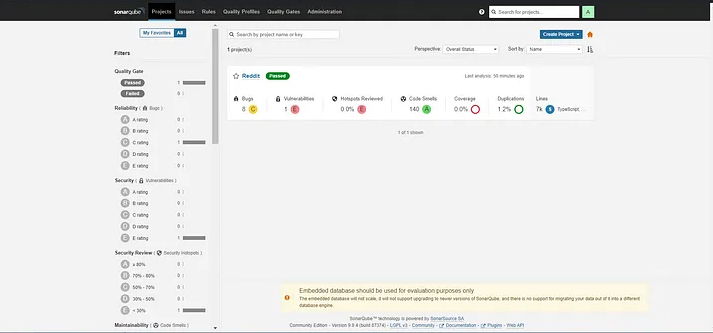
   
     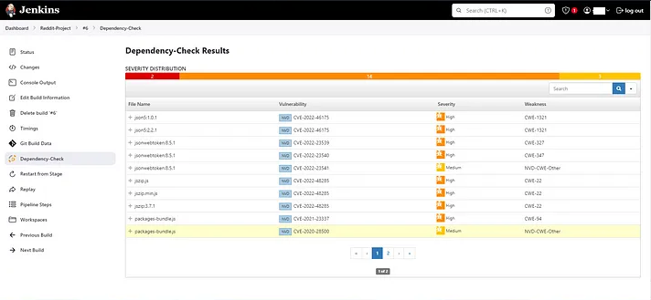
   
     - Display the results of Trivy security scans, SonarQube analysis reports, and Dependency Checker tool outputs.
   
     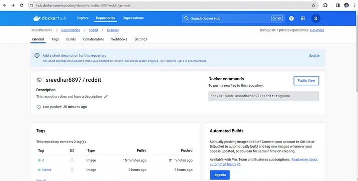
   
     1. Update the deployment file:
        - The deployment file will be automatically updated with the tag corresponding to the Jenkins build number.

------

- ### **Step 4: Configure EKS and ArgoCD**

  #### 1. **Update the EKS Cluster Configuration:**

  ```bash
  aws eks update-kubeconfig --name Reddit-EKS-Cluster
  ```

  This command updates your kubeconfig to include your `Reddit-EKS-Cluster`, allowing you to interact with the cluster using `kubectl`.

  #### 2. **Install ArgoCD** (via Helm on EKS)

  ##### Prerequisites:

  - **A functional EKS cluster**: Your cluster should be set up with AWS CLI and `kubectl` for interacting with the cluster.
  - **Helm installed**: Helm should be configured to manage installations on your EKS cluster.

  ##### Installation Procedure:

  1. **Add the ArgoCD repository**:

  ```bash
  helm repo add argocd https://argoproj.github.io/argo-cd
  ```

  1. **Update the repository cache**:

  ```bash
  helm repo update
  ```

  1. **Install ArgoCD on the EKS cluster**:

  ```bash
  helm install argocd argocd/argo-cd
  ```

  This will install ArgoCD into the `argocd` namespace with default settings.

  ##### Customizing the Installation:

  If you want to customize the installation, you can create a `values.yaml` file. For example, to specify a custom `ingress`:

  ```yaml
  ingress:
    hosts:
      - argocd.datascientest.com
  ```

  Then install with the custom file:

  ```bash
  helm install argocd argocd/argo-cd -f values.yaml
  ```

  ##### Verifying the Installation:

  You can verify the installation with the following commands:

  ```bash
  kubectl get pods -n argocd
  kubectl get services -n argocd
  ```

  #### 3. **Get Access Information for the ArgoCD Server:**

  To retrieve the URL and password for the ArgoCD server, use the following commands:

  ```bash
  export ARGOCD_SERVER=`kubectl get svc argocd-server -n argocd -o json | jq --raw-output '.status.loadBalancer.ingress[0].hostname'`
  export ARGO_PWD=`kubectl -n argocd get secret argocd-initial-admin-secret -o jsonpath="{.data.password}" | base64 -d`
  echo $ARGO_PWD
  ```

  #### 4. **Access the ArgoCD Console:**

  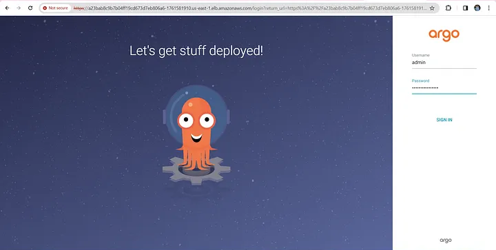" alt="Paris" class="center">

  

  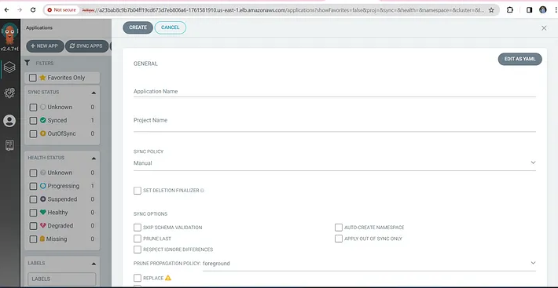" alt="Paris" class="center">

  - Once you have the URL and password, you can log in to the **ArgoCD** user interface via the DNS you configured.

  - Use the URL to access the ArgoCD console and log in with the username `admin` and the retrieved password.

    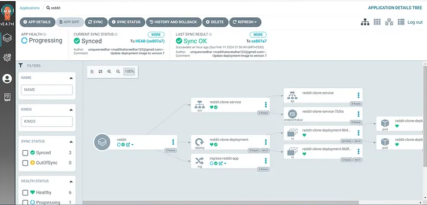" alt="Paris" class="center">

  #### **Create an ArgoCD Application:**

  1. In the ArgoCD console, click **Create App**.
  2. Edit the application YAML as follows, replacing `repoURL` with your GitHub project URL and path `K8s/`:

  ```yaml
  project: default
  source:
    repoURL: 'https://github.com/DataScientest/Project-datascientest-eks-argo-GitOps_EN.git'
    path: K8s/
    targetRevision: HEAD
  destination:
    server: 'https://kubernetes.default.svc'
    namespace: default
  syncPolicy:
    automated:
      prune: true
      selfHeal: true
  ```

  1. Click **Create** to create the application.

  #### **Deploy and Sync the Application:**

  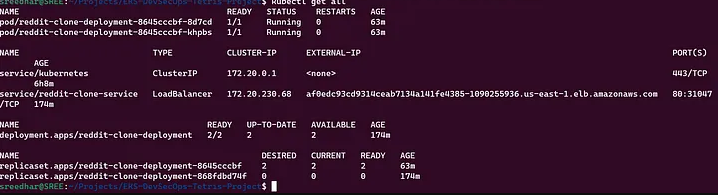" alt="Paris" class="center">

  

  " alt="Paris" class="center">

  - In the ArgoCD console, once the application is created, click **Sync** to deploy and sync the **Reddit** application with your EKS cluster.

  

  

  ### **Step 5: Monitoring with Prometheus and Grafana**

  #### 1. **Deploy Prometheus and Grafana:**

  To install Prometheus and Grafana on your Kubernetes cluster using Helm, follow these steps:

  1. Create a `monitoring` namespace:

  ```bash
  kubectl create namespace monitoring
  ```

  1. Add the Prometheus Helm repository:

  ```bash
  helm repo add prometheus-community https://prometheus-community.github.io/helm-charts
  helm repo update
  ```

  1. Install Prometheus and Grafana:

  ```bash
  helm install prometheus-operator prometheus-community/kube-prometheus-stack -n monitoring
  ```

  #### 2. **Expose Prometheus and Grafana Services:**

  To make Prometheus and Grafana accessible externally, expose them through `LoadBalancer` type services:

  ```bash
  kubectl expose pod <prometheus-pod> --port=8080 --target-port=9090 --name=prometheus-lb --type=LoadBalancer
  kubectl expose pod <grafana-pod> --port=8081 --target-port=3000 --name=grafana-lb --type=LoadBalancer
  ```

  #### 3. **Access Grafana:**

  - Once exposed, you can access Grafana through the public IP associated with your service.

  - Access Grafana via `http://<public_ip>:8081`.

    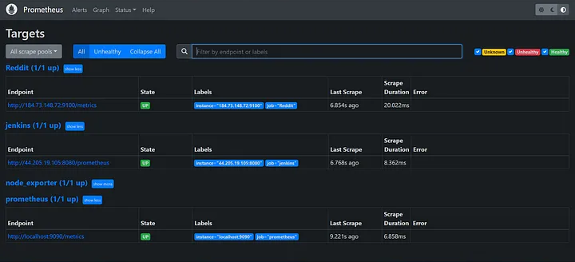" alt="Paris" class="center">

  

  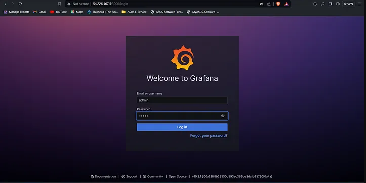" alt="Paris" class="center">

  #### 4. **Log in to Grafana:**

  - Default credentials: `admin/admin`.

  - After logging in, configure **Prometheus** as a data source:

    - Go to **Add Data Source → Prometheus**.

    - Configure the source to point to your Prometheus instance.

      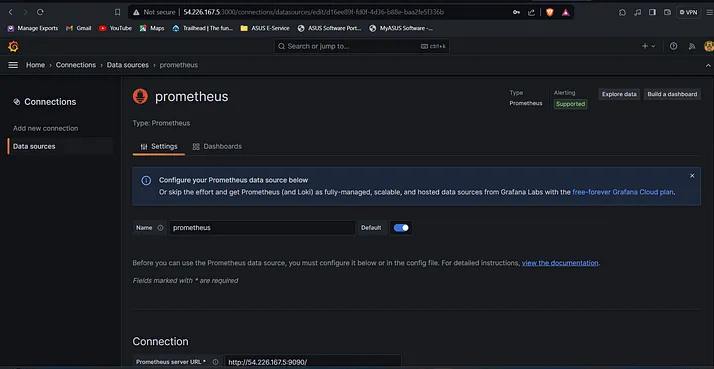" alt="Paris" class="center">

  

  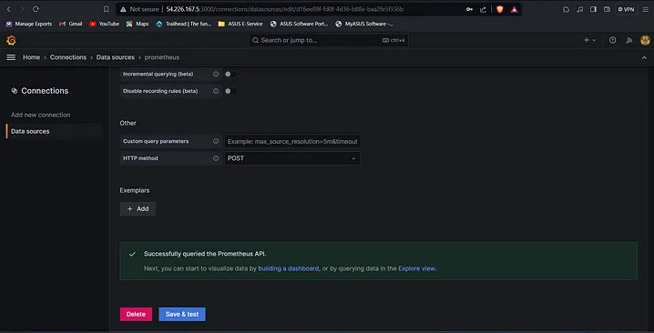" alt="Paris" class="center">

  

  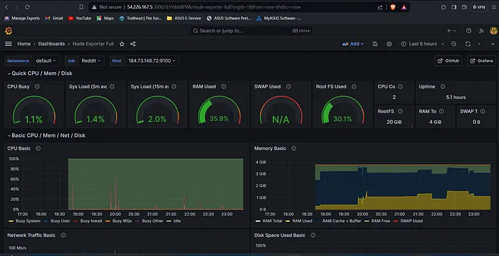" alt="Paris" class="center">

  #### 5. **Analyze and Interpret Metrics:**

  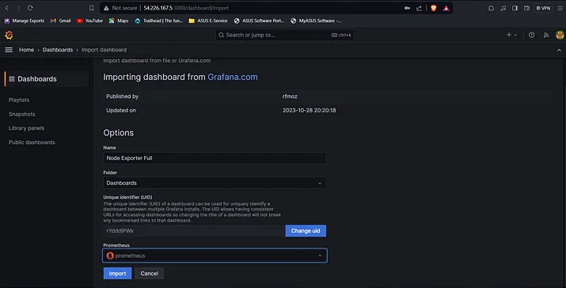" alt="Paris" class="center">

  

  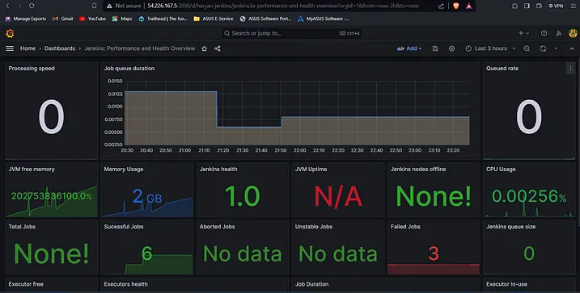" alt="Paris" class="center">

  

  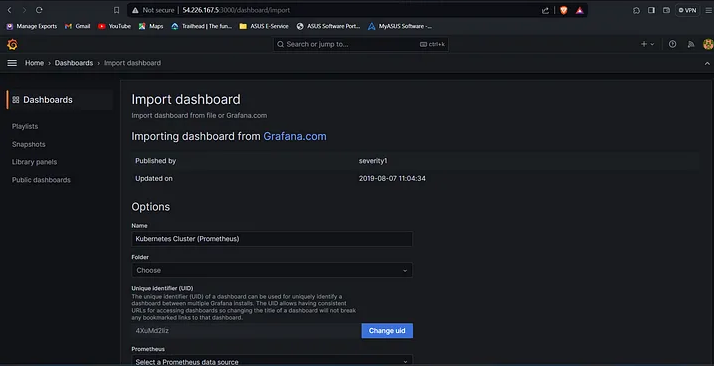" alt="Paris" class="center">

  

  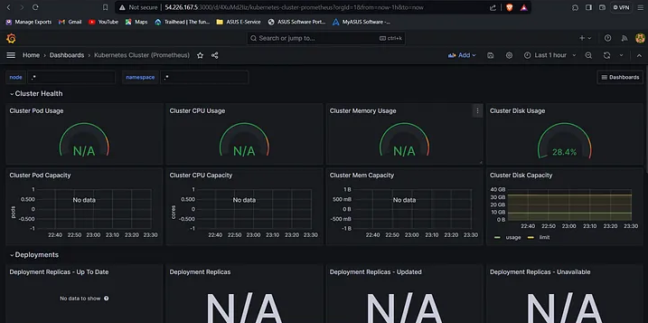" alt="Paris" class="center">

  

  Once Grafana is configured, you will be able to access dashboards displaying metrics from Prometheus. These metrics will help you identify performance bottlenecks and ensure the stability of your application.

  You will be able to visualize metrics such as CPU usage, memory, requests, and more, helping you optimize and adjust your infrastructure for optimal performance.

  

## **Step 6: Backing Up a Kubernetes Cluster with Velero and AWS S3**

#### **1 - Download Velero**

Start by downloading Velero to your local machine.

```bash
curl -L https://github.com/vmware-tanzu/velero/releases/latest/download/velero-linux-amd64.tar.gz -o velero.tar.gz
tar -xvf velero.tar.gz
sudo mv velero /usr/local/bin/
```

#### **2 - Verify the Installation**

Check if Velero is installed correctly.

```bash
velero version
```

#### **3 - Create an S3 Bucket**

Log in to AWS using the `aws-cli` and create an S3 bucket.

```bash
aws s3api create-bucket --bucket velero-backup-bucket --region us-east-1
```

Replace `velero-backup-bucket` with a unique name for your bucket.

#### **4 - Configure an IAM Policy for Velero**

Create an IAM policy that grants Velero access to the S3 bucket. Save the following policy as a file called `velero-policy.json`:

```json
{
  "Version": "2012-10-17",
  "Statement": [
    {
      "Effect": "Allow",
      "Action": [
        "s3:GetObject",
        "s3:ListBucket",
        "s3:PutObject"
      ],
      "Resource": [
        "arn:aws:s3:::velero-backup-bucket/*",
        "arn:aws:s3:::velero-backup-bucket"
      ]
    }
  ]
}
```

Apply this policy to an IAM user or role:

```bash
aws iam create-policy --policy-name VeleroPolicy --policy-document file://velero-policy.json
```

#### **5 - Attach the Policy to an IAM User or Role**

If you're using an IAM role (e.g., for an EKS node), attach the policy using:

```bash
aws iam attach-role-policy --role-name <ROLE_NAME> --policy-arn arn:aws:iam::<ACCOUNT_ID>:policy/VeleroPolicy
```

#### **6 - Install Velero with AWS as the Provider**

Use the following command to deploy Velero on your Kubernetes cluster:

```bash
velero install \
    --provider aws \
    --plugins velero/velero-plugin-for-aws:v1.6.0 \
    --bucket velero-backup-bucket \
    --backup-location-config region=us-east-1 \
    --snapshot-location-config region=us-east-1 \
    --secret-file ./credentials-velero
```

- **`--provider`**: Specifies AWS as the cloud provider.
- **`--plugins`**: Adds the AWS plugin for Velero.
- **`--bucket`**: The name of the S3 bucket created earlier.
- **`--backup-location-config`**: Specifies the AWS region of the bucket.
- **`--secret-file`**: The file containing your AWS credentials.

#### **7 - Create an AWS Credentials File for Velero**

Create a `credentials-velero` file containing your AWS credentials:

```ini
[default]
aws_access_key_id = <YOUR_ACCESS_KEY>
aws_secret_access_key = <YOUR_SECRET_KEY>
```

Place this file in the current directory.

#### **8 - Verify the Velero Deployment**

Once installed, verify that Velero is running correctly:

```bash
kubectl get pods -n velero
```

#### **9 - Backup the Kubernetes Cluster**

Run a full backup of the Kubernetes cluster, including the **etcd** data:

```bash
velero backup create etcd-backup --include-resources configmaps,secrets,pods,namespaces,persistentvolumes
```

#### **10 - Check the Backup Status**

Monitor the status of the backup:

```bash
velero backup describe etcd-backup --details
```

#### **11 - List Available Backups**

List all available backups:

```bash
velero backup get
```

#### **12 - Restore a Cluster from a Backup**

To restore a cluster from an existing backup, use the following command:

```bash
velero restore create --from-backup etcd-backup
```

#### **13 - Check the Restore Status**

Monitor the status of the restore:

```bash
velero restore describe <RESTORE_NAME> --details
```

#### **14 - Automate Backups with Velero**

To schedule automatic backups, use Velero's scheduling feature:

```bash
velero schedule create daily-backup --schedule="0 2 * * *" --include-resources configmaps,secrets,pods,namespaces,persistentvolumes
```

This command schedules a daily backup at 2 AM.

------

## **Conclusion**

By combining Jenkins, ArgoCD, AWS EKS, Prometheus, and Grafana, you create a robust pipeline that automates deployment, security analysis, and monitoring of your applications. This solution embraces DevOps practices, enabling your teams to focus on business value while ensuring security and reliability. **Velero** with an **S3** bucket will provide a robust solution for backing up and restoring critical data in a Kubernetes cluster. This setup guarantees that even in the event of a failure or accidental deletion, you can quickly recover your data and infrastructure.
